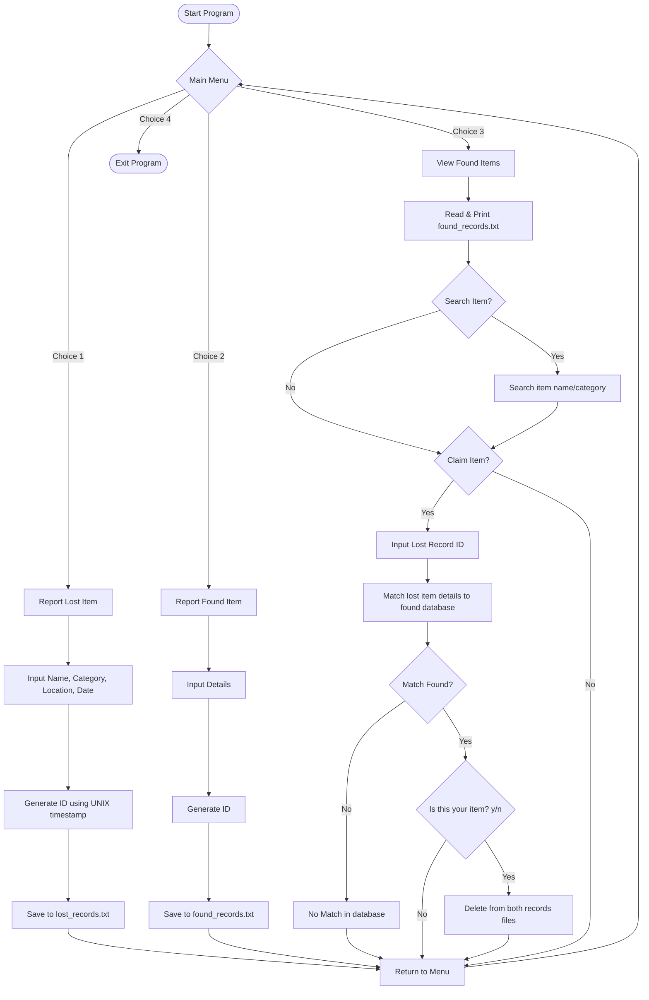

# Digital Lost & Found System

A console-based digital lost and found system written in C that helps manage and track lost/found items. The system lets users register lost or found items, browse found items, search records, and claim matching items using matching parameters and unique IDs.

---

## 📂 Project Structure

The project is modularized, with declarations in header files and implementation details in source files:

*   **[main.c](file:///C:/Users/Manthan/Desktop/Projects/Lost%20and%20Found%20System/main.c)**: Entry point of the program. Runs the CLI menu loop and delegates tasks based on user choice.
*   **headers/**:
    *   **[structure.h](file:///C:/Users/Manthan/Desktop/Projects/Lost%20and%20Found%20System/headers/structure.h)**: Defines the common data structure `Item` used throughout the application.
    *   **[lostItem.h](file:///C:/Users/Manthan/Desktop/Projects/Lost%20and%20Found%20System/headers/lostItem.h)**: Declares functions related to lost item registration and records.
    *   **[foundItem.h](file:///C:/Users/Manthan/Desktop/Projects/Lost%20and%20Found%20System/headers/foundItem.h)**: Declares functions related to found item registration, searching, and claiming.
*   **[lostItem.c](file:///C:/Users/Manthan/Desktop/Projects/Lost%20and%20Found%20System/lostItem.c)**: Implements functions to report lost items and view all lost records.
*   **[foundItem.c](file:///C:/Users/Manthan/Desktop/Projects/Lost%20and%20Found%20System/foundItem.c)**: Implements functions to report found items, view/search found records, and handle claim processes.
*   **[lost_records.txt](file:///C:/Users/Manthan/Desktop/Projects/Lost%20and%20Found%20System/lost_records.txt)**: CSV-style database text file storing reported lost items.
*   **[found_records.txt](file:///C:/Users/Manthan/Desktop/Projects/Lost%20and%20Found%20System/found_records.txt)**: CSV-style database text file storing reported found items.

---

## 🗂️ Core Data Model

The shared data structure is defined in [structure.h](file:///C:/Users/Manthan/Desktop/Projects/Lost%20and%20Found%20System/headers/structure.h):

```c
typedef struct {
    int id;               // Unique ID generated using the epoch timestamp
    char itemName[50];    // Name of the item (spaces replaced by underscore, e.g., Black_HP_Laptop)
    char category[30];    // Category of the item (e.g., Electronics, Keys, Wallet)
    char location[50];    // Location where the item was lost or found
    char date[15];        // Date of event (DD/MM/YYYY)
    char status[10];      // Status: "LOST" or "FOUND"
} Item;
```

---

## ⚙️ Key Functionalities

### 1. Report a Lost Item
*   Users input details about their lost item (name, category, last seen location, date).
*   The system generates a unique `id` using the current UNIX timestamp.
*   The status is set to `"LOST"`.
*   Records are saved as a CSV entry in `lost_records.txt`.

### 2. Report a Found Item
*   Users input details about the item they found.
*   The system generates a unique `id` using the UNIX timestamp.
*   The status is set to `"FOUND"`.
*   Records are saved as a CSV entry in `found_records.txt`.

### 3. Browse and Search Found Items
*   The system allows browsing the list of all found items.
*   Provides a **global search** functionality where users can query items by name or category (case-insensitive search).

### 4. Claiming Items
*   If a user finds their item in the found list, they can claim it by entering their **Lost Record ID** (generated when they reported it lost).
*   The system matches the lost item details (item name, category, and location) against all entries in the found database (case-insensitive comparison).
*   If a match is found, the system presents the match and requests confirmation.
*   Upon confirmation, both the lost record and found record are removed from their respective databases (`lost_records.txt` and `found_records.txt`) using a temporary file renaming routine.

---

## 🔄 Program Flowchart



---

## 🛠️ Build and Execution Instructions

### Prerequisites
*   A C compiler installed on your system (e.g., `gcc` / MinGW).

### Compiling the Project
You can compile the project by combining all source files:

```bash
gcc main.c lostItem.c foundItem.c -o app
```

### Running the Application
Run the generated executable:

**On Windows:**
```cmd
app.exe
```

**On Linux/macOS:**
```bash
./app
```

---

## 🚀 Future Scope
*   **Fuzzy String Matching**: Currently, claiming requires exact case-insensitive matches for the name, category, and location. Adding a fuzzy search algorithm (e.g., Levenshtein distance) would help handle minor spelling mismatches.
*   **Database Integration**: Migrate from file-based `.txt` files to a relational database like SQLite to prevent full-file writes on deletions/updates.
*   **Graphical/Web UI**: Transition the terminal-based CLI to a web or graphical user interface.
